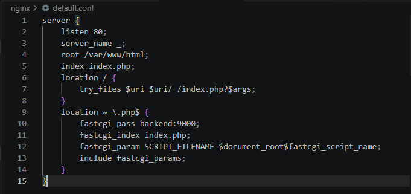
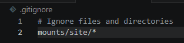
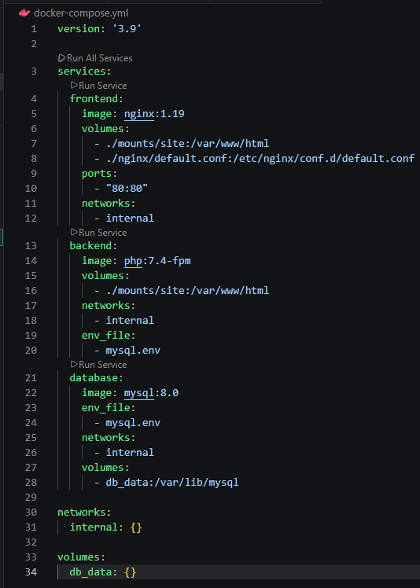
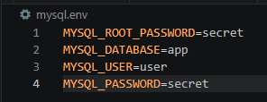
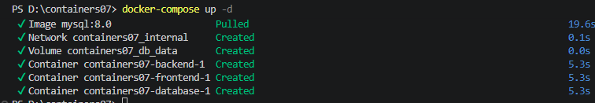
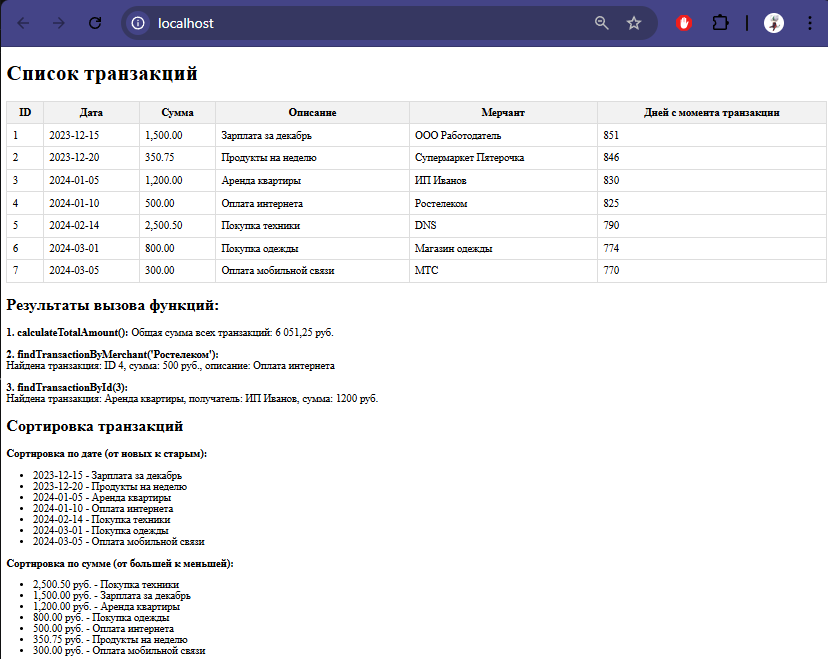

# Лабораторная работа №7: Создание многоконтейнерного приложения

## Цель работы
Ознакомиться с работой многоконтейнерного приложения на базе docker-compose.

## Задание
Создать php приложение на базе трех контейнеров: nginx, php-fpm, mariadb, используя docker-compose.

## Выполнение

### Сайт на php

Я добавила один из сайтов из лабораторных по PHP в директорию mounts/site

### Конфигурационные файлы

Вот так выглядят созданные файлы:









## Запуск и тестирование

Использую в терминале команду 

```bash
docker-compose up -d
```



Перехожу по адресу http://localhost



Получаю страницу со своим сайтом из лабораторной работы